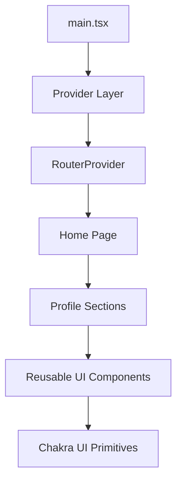

# Alma Artifex System Specification

This document defines the system-level specification, architecture, core concepts, invariants, and future evolution plan for Alma Artifex.

## Problem Statement

Alma Artifex is a professional profile application intended to present a person's career story in a organized and attractive way. It's purposes are:

- personal professional bios and portfolios
- public-facing profile pages for skilled workers
- future multi-user deployment with editable profile content

The current implementation uses placeholder data and is built to be easily forked and extended by others.

## Product Goals

1. Present professional identity clearly and attractively
2. Keep a simple, responsive experience that loads quickly
3. Make content easily editable with a structured data model
4. Be as easily extendable as possible

## Core Product Concepts

### Profile-Centered Content Model

The app centers around a single structured profile object that contains:

- personal and professional identity fields
- short and long bio text
- work history entries
- education entries
- credentials
- testimonials
- social links
- video options
- contact information

This content is defined in [src/data/profile.ts](src/data/profile.ts) and typed in [src/data/types.ts](src/data/types.ts).

### Section-Based Presentation

The experience is organized into distinct UI sections that mirror a professional profile page:

- hero/profile introduction
- short bio
- work history
- video section
- credentials and education
- testimonials
- contact form

These sections are composed from reusable UI components and page-level sections.

### Placeholder Data First

The current GitHub version intentionally uses placeholder content so the repository can be shared and reused without exposing personal information.

This makes the app useful as:

- a personal showcase template
- a demo application
- a foundation for a future real profile deployment

## Application Architecture

### Frontend

The user interface is built as a React single-page application using:

- Vite for build tooling
- React for component rendering
- TypeScript for type safety
- Chakra UI for design system primitives and responsive layout
- TanStack Router for route management
- TanStack Query for data and async state

### Data Layer

At the moment, the app uses a local static data object stored in the frontend codebase.

In the future, the data layer can evolve to:

- fetch profile content from a backend API
- read from DynamoDB
- serve media from S3
- allow admin updates through a secure control interface

### Future Backend Direction

The long-term architecture is planned to support:

- S3 + CloudFront for static hosting
- API Gateway + Lambda for backend endpoints
- SQS for asynchronous message flows
- SES for email delivery
- DynamoDB for profile and content storage
- Cognito for authenticated editing access

## Component Hierarchy

## Data Model

The primary application data shape is represented by the `Profile` type.

Key fields include:

- `name`, `title`, `location`, `pronouns`
- `shortBio`, `longBio`
- `socials`
- `workHistory`
- `education`
- `credentials`
- `testimonials`
- `videoOptions`
- `profileOptions`

This model is intentionally structured so it can be mapped into a backend-driven schema later.

## Expected Behaviors

### Local Development

1. The app runs locally with hot module replacement
2. The profile page renders from the local placeholder data file
3. Content can be changed by editing the data source
4. Styling and layout remain responsive across screen sizes

### Production Behavior

1. The app is deployable as a static single-page app
2. The frontend can be served from S3 and CloudFront
3. The contact form can later connect to an API layer
4. The UI should remain functional even when content is loaded from a remote source

## Constraints

### Frontend Constraints

- TypeScript is used throughout and should remain type-safe
- Path aliases should be used for app source imports
- Component naming and file organization should follow the repository conventions
- The app should remain easy to customize and extend

### Content Constraints

- Placeholder content should not be mistaken for real personal data
- The data model should remain consistent even as storage moves from static JSON to backend services
- Any future admin editing system should preserve data structure and validation rules

## Non-Goals for the Current Version

The current GitHub version does not attempt to provide:

- a production authentication system
- a full CMS backend
- multi-tenant account management
- real database-backed editing workflows
- live integrations for form handling

These are planned for later phases.

## Invariants Summary

1. The profile page is content-driven and should remain easy to repurpose.
2. The data contract should stay consistent across static and backend-backed versions.
3. The UI should remain reusable and composable.
4. The app should remain deployable as a static frontend even before backend services are added.
5. The long-term system should support both personal and multi-user scenarios.

## Runtime Assumptions

- Node.js and pnpm are used for local development
- The app is designed for modern browsers
- The default development experience targets local Vite hosting
- Future deployment assumes AWS static hosting and serverless backend services

